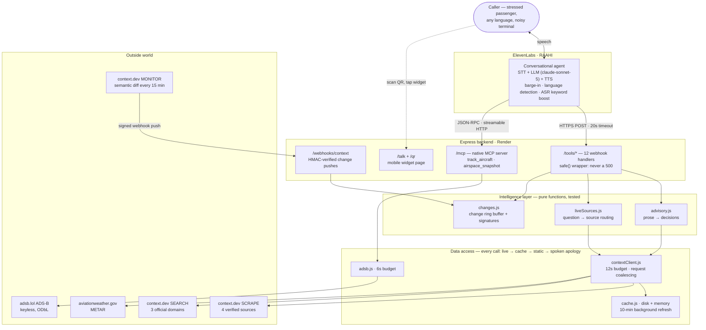

# IROPS Copilot

A voice-first flight-disruption copilot. You call it, say *"I'm flying from Uganda to London
through Dubai — am I going to get there?"*, and it reads the Emirates travel-updates page
**at that moment** and tells you the truth: there is a live UAE entry restriction, it
applies to indirect routings, and here is the one condition that would let you travel.

That answer is not in any database. It exists as a sentence on a web page that changed on
6 June and will change again.

Built for the BUiD Voice Agents Hackathon, Dubai — 8 August 2026.

- **Live backend:** https://irops-copilot-backend.onrender.com ([health](https://irops-copilot-backend.onrender.com/healthz))
- **Voice layer:** ElevenLabs Conversational Agents — 12 webhook tools + a native MCP server
- **Live web data:** [context.dev](https://context.dev) — scrape, web search, and change-detection Monitors
- **Live aircraft data:** [adsb.lol](https://adsb.lol) ADS-B (keyless, ODbL)
- **Backend:** Node 18+ / Express on Render, 49 tests, zero runtime dependencies beyond Express + node-fetch

<p align="center">
  <br/>
  <b>Scan to talk to RAAHI</b> — any phone, no install, just a browser and a microphone.<br/>
  Or open <a href="https://irops-copilot-backend.onrender.com/talk">irops-copilot-backend.onrender.com/talk</a>
  &middot; projectable version at <a href="https://irops-copilot-backend.onrender.com/qr">/qr</a>
</p>

**Deep dives:** [Architecture walkthrough](docs/architecture.md) — how a question penetrates
every layer, with the demo call traced hop by hop · [Question bank](docs/question-bank.md) —
every class of question the agent answers, and what it honestly refuses ·
[Demo script](docs/demo-script.md) · [TECH-SPEC](TECH-SPEC.md)

---

## What it does

During irregular operations — a suspended route, an entry restriction, a cancelled flight —
the information a passenger needs changes without warning and lives as prose on an airline's
travel-updates page. Nobody reads it standing at a departure board. IROPS Copilot puts that
page behind a voice agent.

As of 8 August 2026, the live page carries an Ebola-driven UAE entry restriction covering
the Democratic Republic of Congo, Uganda and South Sudan, in force until further notice, and
it explicitly applies to passengers arriving by indirect routings. A passenger flying
Kampala→Dubai→London is affected even though neither their destination nor their airline is.
That is the class of answer this agent gets right.

The agent handles nine things: whether a route is suspended and until when, whether transit
through Dubai to a given destination is being accepted, what entry paperwork the EU and UK
now demand, a specific flight's schedule and where the aircraft physically is, current
airport weather and its operational impact, rebooking options, passenger entitlements,
stranded-passenger support, and a staff-facing turnaround brief.

Five of the nine read live data on every call; the rest serve static data with a live
cross-check layered on top. Which one you got is in the `source` field of every response —
see [What is actually live](#what-is-actually-live). The agent is instructed never to answer
route or weather questions from memory.

---

## Architecture



```
   Caller (phone / web widget)
            │  speech
            ▼
  ┌──────────────────────────┐
  │  ElevenLabs Conversational│   STT → LLM (tool-calling) → TTS
  │  Agent                    │   interruption handling, voice design
  └───────────┬──────────────┘
              │  HTTPS POST, 9 webhook tools, 20s timeout
              ▼
  ┌──────────────────────────┐
  │  IROPS backend (Express)  │   src/server.js
  │  /tools/* — 9 endpoints   │   src/routes/tools.js
  └───────────┬──────────────┘
              │
      ┌───────┴────────┬──────────────────┐
      ▼                ▼                  ▼
 context.dev    aviationweather  adsb.lol   disk + memory cache
 scrape→Markdown  .gov METAR      ADS-B      src/lib/cache.js
      │               │              │             │
      ▼               ▼              ▼             ▼
 emirates.com    OMDB observation  live      last good response
 /travel-updates                   aircraft        │
      │                            position        ▼
      └── parsed by advisory.js ──┴────────────┴──> mock fallback
                                                 src/data/mocks.js
```

**The degradation chain is the point.** Every endpoint tries live, falls back to the last
cached scrape, then falls back to static data — and never returns a non-200 to ElevenLabs.
A tool that errors out is a voice agent that goes silent mid-sentence, which is worse than
a slightly stale answer. See [Reliability](#reliability-design) below.

---

## Setup

Assumes a clean machine with **Node 18 or newer** (`node -v` to check).

```bash
git clone https://github.com/sirajtechy/irops-copilot-backend.git
cd irops-copilot-backend
npm install
cp .env.example .env
```

Open `.env` and set your context.dev API key (free tier is enough — sign up at
<https://context.dev>):

```
CONTEXT_DEV_API_KEY=your_key_here
```

Run it:

```bash
npm start
```

The server listens on `http://localhost:3000` and warms its cache on boot. Check it:

```bash
curl http://localhost:3000/healthz
```

Run the test suite (it deliberately runs with **no** API key, to prove the offline path):

```bash
npm test
```

### Environment variables

| Variable | Required | Default | Purpose |
| --- | --- | --- | --- |
| `CONTEXT_DEV_API_KEY` | For live data | — | context.dev bearer token. Without it every endpoint still answers, from cache or mock. |
| `PORT` | No | `3000` | Render injects this. |
| `TOOL_SHARED_SECRET` | No | *(off)* | If set, `/tools/*` and `/admin/*` require an `x-tool-secret` header. |
| `FETCH_TIMEOUT_MS` | No | `8000` | Outbound fetch timeout. Keep well under the ElevenLabs 20s tool timeout. |

---

## The twelve tools

All are `POST`, all take and return JSON, all respond `200`.

| Tool | Input | Returns | Data source |
| --- | --- | --- | --- |
| `/tools/disruption_status` | `{ destination }` | `blocked`, `restriction_type`, `suspended`, `suspended_until`, `open_ended`, `extended_before`, `advisory_text`, `source` | context.dev → emirates.com travel-updates |
| `/tools/transit_rules` | `{ origin, final_destination }` | `transit_allowed`, `conditional`, `explanation`, `source` | context.dev → emirates.com travel-updates |
| `/tools/stranded_support` | `{ location }` | `location`, `support_text`, `source` | context.dev, with static baseline |
| `/tools/flight_status` | `{ flight_no }` | flight record, `live_position`, `airborne`, `live_note`, `schedule_source`, `position_source` | **Schedule: static.** **Position: live ADS-B via adsb.lol.** See note below |
| `/tools/weather_ops` | `{ airport }` | `metar`, `wind`, `ops_impact`, `source` | aviationweather.gov METAR (keyless) |
| `/tools/rebooking_options` | `{ flight_no? , destination? }` | `options[]`, `route_blocked`, `advice`, `source` | Static schedule + live advisory cross-check |
| `/tools/policy_lookup` | `{ topic }` | `summary`, `source_hint` | Static policy baseline |
| `/tools/turnaround_brief` | `{ flight_no }` | stand, ground time, critical path, `risks[]`, station weather | Static brief + live METAR |
| `/tools/entry_requirements` | `{ destination }` | `region`, `applies`, `action_required`, `requirements[]`, `exemptions[]`, `official_source`, `source` | context.dev → emirates.com + gov.uk + europa.eu, search fallback for anywhere else |
| `/tools/journey_brief` | `{ pnr }` | `headline`, `next_action`, `clear_to_travel`, `checks[]`, `segments` | Demo booking store + **five live checks fanned out in parallel** |
| `/tools/recent_changes` | `{ within_minutes? }` | `changed`, `minutes_ago`, `summary`, `changes[]` | context.dev **Monitor** webhook |
| `/tools/travel_intel` | `{ question, destination? }` | `answer`, `sources[]`, `source` | context.dev **web search** over airline/government domains |

`flight_status` is the one tool that mixes two feeds, so it carries two source fields.
`schedule_source` is always `mock` — no keyless source publishes gate numbers or delay
minutes, and we do not pretend otherwise. `position_source` is a genuine live transponder
fix from [adsb.lol](https://adsb.lol) (ODbL). ADS-B can tell you an aircraft is at 37,000
feet and descending; it cannot tell you a flight is cancelled, and `airborne: false` means
"not tracked in the air" — not departed, or out of receiver coverage — never "cancelled".

Plus: `GET /` (liveness string), `GET /healthz` (`ok`, `cache_entries`, `advisory_cached_at`,
`advisory_age_s`, `cache_refresh_ms`, `uptime_s`), `POST /admin/warm` (re-prime the cache
before a demo).

Try the live path:

```bash
curl -s -X POST http://localhost:3000/tools/transit_rules -H 'content-type: application/json' -d '{"origin":"Uganda","final_destination":"London"}'
```

If `"source"` comes back `"live"`, context.dev is wired up correctly.

---

## How the voice agent calls it

The ElevenLabs agent is configured with twelve **webhook tools**, one per endpoint. Each
posts JSON to `https://<your-render-url>/tools/<name>` with a 20-second timeout, and the
agent reads the returned fields aloud.

The system prompt, voice settings, and all twelve tool definitions are in
[`elevenlabs/`](elevenlabs/) — [`agent-prompt.md`](elevenlabs/agent-prompt.md) is
copy-pasteable into the dashboard, and [`elevenlabs/tools/*.json`](elevenlabs/tools/) mirror
the webhook tool shape field-for-field.

The agent also has a native **MCP server** attached — the backend serves the Model Context
Protocol at `/mcp` (streamable HTTP, JSON-RPC), and ElevenLabs connects to it directly and
discovers two live flight-tracking tools: `track_aircraft` and `airspace_snapshot`. We
evaluated the public flight-tracking MCPs (airplanes-live-mcp, google-flights-api,
Flight-Search-MCP-Server) first: all three are stdio packages built for desktop clients,
which ElevenLabs cannot attach to (it consumes MCP by hosted https URL), two need paid API
keys, and airplanes.live's terms are non-commercial. Hosting the capability ourselves on
adsb.lol (ODbL) gave the same tools, licensed, in the process we already run. Webhooks
answer schedule-and-policy questions; MCP answers physical-world ones — the agent uses both
ElevenLabs integration paths side by side.

You do not have to paste any of it by hand. The repo is the source of truth and
[`scripts/provision-elevenlabs.js`](scripts/provision-elevenlabs.js) pushes it up:

```bash
ELEVENLABS_API_KEY=... BACKEND_URL=https://<your-render-url> \
  node scripts/provision-elevenlabs.js --dry-run   # inspect first
ELEVENLABS_API_KEY=... BACKEND_URL=https://<your-render-url> \
  node scripts/provision-elevenlabs.js
```

It creates or updates one webhook tool per JSON file — rewriting every URL to `BACKEND_URL`,
so a stale host cannot survive a redeploy — extracts the system prompt and first message
from `agent-prompt.md`, and creates or updates the agent. It matches on name, so it is
idempotent and safe to re-run after any edit. Re-pointing nine tools by hand is nine chances
to miss one, and a tool left on a dead URL fails silently mid-conversation.

Two things in the prompt do real work:

1. **The agent is forbidden from answering route or weather questions from memory.** Those
   change hourly; a plausible-sounding stale answer is the failure mode that matters here.
2. **Every tool returns a `source` field** (`live` / `cache` / `none` / `mock` / `baseline`)
   and the agent is instructed to hedge its phrasing accordingly — *"as of the last update
   I have"* — without ever saying the word "cache" out loud.

---

## Reliability design

An ElevenLabs tool call that fails leaves the agent silent mid-conversation. So:

- **12-second outbound timeout** via `AbortController`, against a 20-second ElevenLabs
  budget — a slow scrape can never hang the call. A cold scrape measures ~5–8s, a warm one
  ~0.7s, so the cache is what keeps the demo conversational.
- **Never a bare 500.** Every handler is wrapped so any throw becomes
  `200 {"status":"degraded","message":"<spoken-friendly sentence>"}`, which the agent reads
  aloud gracefully.
- **Two-layer cache** (`src/lib/cache.js`): disk under `./cache`, mirrored in memory so a
  read-only filesystem doesn't break it. Warmed on boot, refreshed on a 5-minute background
  timer, and re-primeable via `POST /admin/warm`. The timer bounds how stale a served
  `source: "cache"` answer can be, which is what makes the `cached_at` we report defensible;
  `/healthz` exposes `advisory_age_s` so you can check it rather than take our word.
- **Static fallback** (`src/data/mocks.js`) so the demo survives total internet loss.

`npm test` runs the whole suite with `CONTEXT_DEV_API_KEY` blank and the cache cleared —
42 tests asserting every endpoint still returns 200, still carries a spoken message, and
still comes in under the timeout budget. Fourteen of those pin the parsers against verbatim
excerpts of the live advisory page, so a regression in the prose handling fails the build
rather than the demo.

---

## What is actually live

The brief penalises claiming more than you built, so here is the exact split. Every response
carries a `source` field, so you can verify each row yourself rather than trusting the table.

| Tool | Live on every call? | What is live | What is static |
| --- | --- | --- | --- |
| `disruption_status` | **Yes** | Emirates travel-updates page via context.dev | — |
| `transit_rules` | **Yes** | Emirates travel-updates page via context.dev | — |
| `entry_requirements` | **Yes** | EU EES + UK ETA sections of the same page | — |
| `weather_ops` | **Yes** | aviationweather.gov METAR | — |
| `stranded_support` | Live-capable | Reads the live page for hotel/voucher language | Falls back to a static baseline — and today's page has no such language, so it returns `source: "baseline"` |
| `flight_status` | **Partly** | Aircraft position from adsb.lol ADS-B (`position_source`) | Schedule, gate, delay, cancellation (`schedule_source: "mock"`) |
| `rebooking_options` | Cross-check | Live advisory decides `route_blocked` | The seats themselves |
| `turnaround_brief` | Cross-check | Live METAR for the station | The brief itself |
| `policy_lookup` | No | — | Entirely static; entitlements genuinely do not change hourly |
| `recent_changes` | **Yes** | context.dev Monitor pushes advisory changes to our webhook | — |
| `travel_intel` | **Yes** | context.dev web search over airline/government domains | — |
| `journey_brief` | **Partly** | All five checks it fans out are live | The PNR-to-itinerary lookup only (`booking_source: "demo_booking"`) |
| `track_aircraft` (MCP) | **Yes** | ADS-B transponder fix via adsb.lol | — |
| `airspace_snapshot` (MCP) | **Yes** | Live traffic within 100nm of an airport | — |

Things we deliberately do **not** claim:

- **No real booking or PNR integration.** `journey_brief` accepts a record locator and
  resolves it against a demo store, because emirates.com/manage-booking is
  authentication-gated — we scraped it and got a login redirect, not an itinerary. Every
  check performed *on* that itinerary is live. The response labels the lookup
  `booking_source: "demo_booking"` and the agent is told never to invent passenger details.
- **No live gate, delay or cancellation feed.** Those need a commercial contract (Cirium,
  FlightAware). We tried the keyless options; ADS-B gives position, not schedule, and we
  label it as position.
- **No mid-conversation invalidation.** We re-fetch per tool call. If the advisory changes
  while someone is mid-sentence, they will not hear about it until the next tool call.
- **No streaming.** Request/response webhooks only.

---

## Deploy

The repo carries a [`render.yaml`](render.yaml), so Render configures itself:

1. Sign in to <https://render.com> with GitHub.
2. **New → Web Service** → select this repo. Render reads `render.yaml` (Node, free plan,
   `npm install` / `npm start`, health check on `/healthz`).
3. In the dashboard, set `CONTEXT_DEV_API_KEY` (marked `sync: false`, so it is not in git).
4. Deploy. Your URL will be `https://irops-copilot-backend.onrender.com`.

Then, in ElevenLabs, run `scripts/provision-elevenlabs.js` to point all twelve tools at the Render URL.

> Render's free tier sleeps after inactivity and takes ~30s to wake. Hit `/healthz` and
> `POST /admin/warm` a minute before demoing.

---

## Project layout

```
src/server.js            Express app, health, admin, error floor
src/routes/tools.js      All 8 /tools/* handlers
src/lib/contextClient.js context.dev wrapper — live → cache → none
src/lib/adsb.js          adsb.lol live aircraft position (keyless)
src/lib/cache.js         Disk + memory cache
src/lib/advisory.js      Parses advisory prose into structured answers
src/data/mocks.js        Static fallback: flights, policies, schedules
test/                    19 tests, run with no network
elevenlabs/              Agent prompt, voice settings, 12 tool definitions
docs/demo-script.md      The three-question demo run
TECH-SPEC.md             Engineering reasoning
```

---

## Feature log

Everything built, in the order it was earned. Each row is verifiable in the commit history.

| # | Feature | The judgement call inside it |
| --- | --- | --- |
| 1 | 8 webhook tools, degradation chain (live → cache → static → spoken apology) | A failed tool call is a voice agent going silent mid-sentence, so no endpoint may ever 500 |
| 2 | Advisory parser (`lib/advisory.js`) | Restrictions key off where you have *been*: destination-only matching tells the Kampala passenger she is fine. She is not |
| 3 | Live scrape via context.dev, cache warm on boot + 10-min background refresh | `/healthz` exposes `advisory_age_s` so the freshness claim is checkable, not asserted |
| 4 | ADS-B live aircraft position (`flight_status`, split sources) | `schedule_source: mock` next to `position_source: live` — the live half must not lend credibility to the static half |
| 5 | `entry_requirements` — EU EES + UK ETA | Main-clause classification: "If you do **not** need a visa… you **will** need an ETA" is a requirement, not an exemption |
| 6 | Markdown-aware sentence splitting | "Last updated: … (GMT+4)" has no full stop and was gluing itself to the next paragraph, hiding the ETA rule |
| 7 | Multi-source registry — gov.uk, europa.eu, EK FAQ | Every URL verified by an actual scrape before inclusion; three plausible ones 404'd and were left out |
| 8 | `travel_intel` — context.dev web search fallback | Allowlisted to 3 official domains — measured: 2 domains 2.4s, 10 domains 40s+, so the cap is a latency decision |
| 9 | context.dev **Monitor** + signed webhook + `recent_changes` | Polling says what a page says; a monitor says it *changed*. HMAC + replay rejection because a forged webhook is a lie-injection vector |
| 10 | `journey_brief` — PNR → 5 parallel live checks in ~2s | Precedence: refused-at-gate beats closed-destination beats paperwork. The PNR store is the one labelled stub |
| 11 | Native **MCP server** at `/mcp` + 2 tracking tools | The registry MCPs are stdio-only and unattachable; we host the capability class ourselves on licensed data |
| 12 | Request coalescing | 3 parallel identical scrapes = 1 request; found when a 12-tool burst blew the 10 req/min limit |
| 13 | Agent behavioural hardening | Simulation caught it fabricating an all-clear from a stubbed tool and caving to repeated questions — both now forbidden and pinned |
| 14 | ElevenLabs to the fullest | ASR keyword boosting, eager turns, tool-call sounds, end_call, language detection, post-call evaluation criteria + data collection |

---

## Team

Team — BUiD Voice Agents Hackathon, Dubai, 8 August 2026.
