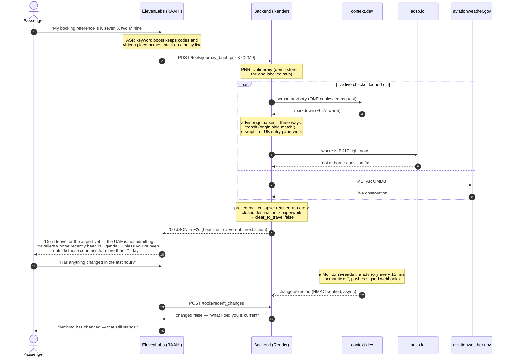

# Architecture walkthrough — how a question becomes an answer

This is the memory diagram for the demo: every layer, what it owns, and how one
caller's question penetrates the whole stack and comes back as speech. Present it
top to bottom — that is the direction the data flows.

---

## The stack at a glance

```
┌─────────────────────────────────────────────────────────────────────────────┐
│  L1 · CALLER                                                                │
│  A stressed passenger in a terminal. Hands full, eyes on a departure board. │
└──────────────┬──────────────────────────────────────────────────────────────┘
               │ speech (any language; ASR keyword-boosted for aviation terms)
┌──────────────▼──────────────────────────────────────────────────────────────┐
│  L2 · ELEVENLABS CONVERSATIONAL AGENT            "IROPS Copilot"            │
│  STT → LLM (claude-sonnet-5, temp 0) → TTS (flash v2, calm voice, 0.95x)   │
│  Owns: turn-taking, barge-in, language switching, when to call which tool   │
│  Governed by: elevenlabs/agent-prompt.md (never stall · never invent an     │
│  all-clear · never soften under pressure · attribute searched answers)      │
└────┬─────────────────────────────────────────────┬──────────────────────────┘
     │ 12 webhook tools                            │ 1 native MCP server
     │ HTTPS POST /tools/*                         │ JSON-RPC POST /mcp
     │ (schedule & policy questions)               │ (physical-world questions)
┌────▼─────────────────────────────────────────────▼──────────────────────────┐
│  L3 · EXPRESS BACKEND (Render, Node 18)         src/server.js               │
│  Owns: the 15-second budget, the never-500 guarantee, auth, logging         │
│  ┌────────────────┐  ┌──────────────┐  ┌──────────────────────────────┐    │
│  │ routes/tools.js │  │ routes/mcp.js │  │ POST /webhooks/context       │    │
│  │ 12 handlers,    │  │ MCP protocol, │  │ HMAC-verified change pushes  │    │
│  │ safe() wrapper  │  │ 2 live tools  │  │ from context.dev Monitors    │    │
│  └───────┬────────┘  └──────┬───────┘  └──────────────┬───────────────┘    │
└──────────┼──────────────────┼──────────────────────────┼────────────────────┘
           │                  │                          │
┌──────────▼──────────────────▼──────────────────────────▼────────────────────┐
│  L4 · INTELLIGENCE LAYER (pure functions, microsecond-fast, fully tested)   │
│  lib/advisory.js     prose → decisions (two-sided transit match, sentence   │
│                      windows, main-clause classification, alias resolution) │
│  lib/liveSources.js  question → which source answers it; search fallback    │
│  lib/changes.js      monitor webhook verification + change ring buffer      │
│  lib/adsb.js         callsign mapping, position & airspace snapshots        │
└──────────┬───────────────────────────────────────────────────────────────────┘
           │ everything below here is the outside world
┌──────────▼───────────────────────────────────────────────────────────────────┐
│  L5 · DATA ACCESS (lib/contextClient.js · lib/adsb.js · lib/cache.js)        │
│  Degradation chain on every call:  live → cache → static → spoken apology    │
│  12s scrape budget · 10s search budget · 6s ADS-B budget · request           │
│  coalescing (3 concurrent identical scrapes = 1 HTTP request)                │
└───┬───────────────┬────────────────┬──────────────────┬──────────────────────┘
    │               │                │                  │
┌───▼────────┐ ┌────▼─────────┐ ┌────▼──────────┐ ┌─────▼──────────┐
│ context.dev│ │ context.dev  │ │ context.dev   │ │ keyless feeds  │
│ SCRAPE     │ │ WEB SEARCH   │ │ MONITORS      │ │ adsb.lol ADS-B │
│ 4 verified │ │ allowlisted  │ │ semantic diff │ │ aviationweather│
│ sources    │ │ 3 domains    │ │ every 15 min, │ │ .gov METAR     │
│ (advisory, │ │ (official    │ │ HMAC-signed   │ │                │
│ gov.uk ETA,│ │ sites only)  │ │ webhook push  │ │                │
│ europa.eu, │ └──────────────┘ └───────────────┘ └────────────────┘
│ EK FAQ)    │
└────────────┘
```

Two design rules hold at every boundary:

1. **Failure flows down gracefully, never up loudly.** Any layer may fail; the layer
   above always receives a spoken-friendly answer with a `source` field admitting
   what it is (`live` / `cache` / `mock` / `baseline` / `none`). No tool ever
   returns a 500 to ElevenLabs, because a failed tool call is a voice agent going
   silent mid-sentence.
2. **Honesty is carried in-band.** Every response labels its own freshness, and the
   agent's phrasing is bound to that label — `live` may be stated as fact, `cache`
   becomes "as of the last update I have", `mock` becomes "the schedule shows",
   `none` becomes "I could not verify — check with Emirates".

---

## The demo call, hop by hop

Caller: **"My booking reference is K seven X two M nine — should I leave for the airport?"**



```
 CALLER          ELEVENLABS              BACKEND                 SOURCES
   │                 │                      │                       │
   │ ①  speech       │                      │                       │
   ├────────────────►│                      │                       │
   │                 │ ② STT hears "K7X2M9" (ASR keyword-boosted    │
   │                 │    so codes and African place names survive  │
   │                 │    a noisy line)                             │
   │                 │                      │                       │
   │                 │ ③ LLM picks journey_brief — the prompt says  │
   │                 │    a PNR always routes there first           │
   │                 │                      │                       │
   │                 │ ④ POST /tools/journey_brief {"pnr":"K7X2M9"} │
   │                 ├─────────────────────►│                       │
   │                 │                      │ ⑤ PNR → itinerary     │
   │                 │                      │   (demo store — the   │
   │                 │                      │   ONE labelled stub)  │
   │                 │                      │                       │
   │                 │                      │ ⑥ fan out IN PARALLEL │
   │                 │                      ├──────────────────────►│ scrape advisory (context.dev,
   │                 │                      │                       │   ~0.7s warm; ONE request,
   │                 │                      │                       │   coalesced, parsed 3 ways):
   │                 │                      │                       │   → transit_rules (Kampala!)
   │                 │                      │                       │   → disruption (London)
   │                 │                      │                       │   → entry paperwork (UK ETA)
   │                 │                      ├──────────────────────►│ adsb.lol: where is EK17 now
   │                 │                      ├──────────────────────►│ aviationweather.gov: OMDB METAR
   │                 │                      │                       │
   │                 │                      │ ⑦ advisory.js reads the scraped prose:
   │                 │                      │   · finds "will not allow entry ... DRC,
   │                 │                      │     Uganda, or South Sudan" — matches the
   │                 │                      │     ORIGIN side, not the destination
   │                 │                      │   · reads the neighbouring sentence for the
   │                 │                      │     21-day carve-out ("unless ... more than
   │                 │                      │     21 days")
   │                 │                      │   · "until further notice" → open-ended,
   │                 │                      │     NOT an end date
   │                 │                      │                       │
   │                 │                      │ ⑧ precedence collapse: gate-refusal beats
   │                 │                      │   closed destination beats paperwork
   │                 │                      │   → clear_to_travel: false
   │                 │ ⑨ 200 JSON, ~1-2s    │                       │
   │                 │◄─────────────────────┤                       │
   │                 │ ⑩ LLM speaks headline FIRST, carve-out       │
   │                 │    SECOND, next action THIRD                 │
   │ ⑪ "Don't leave  │                      │                       │
   │  for the airport│                      │                       │
   │  yet — ..."     │                      │                       │
   │◄────────────────┤                      │                       │
```

The same six characters fan out to **five independent live checks** and come back
as one decision in about two seconds. The contrast case proves it is real: PNR
`P3L8QK` (Mumbai → Dubai → London, same destination) returns `clear_to_travel:
true`, because the restriction keys off where the passenger has *been* — the
two-sided match that is the intellectual core of the project.

---

## The layers in words (30-second version for the demo)

- **ElevenLabs owns the conversation** — hearing a stressed caller over airport
  noise, letting them interrupt, switching to Arabic or Hindi, deciding which of
  fourteen tools answers the question.
- **The Express backend owns reliability** — a hard 15-second budget, a
  never-500 guarantee, and one labelled demo stub (the PNR store), because
  real booking data is an airline contract, not a hackathon.
- **The intelligence layer owns judgement** — turning airline prose into
  decisions: restrictions that key off *origin*, carve-outs hiding in
  subordinate clauses, "effective 6 June" not being an end date.
- **context.dev owns the outside world** — scraping the advisory to clean
  Markdown, searching official domains for the long tail, and *pushing* changes
  to us within fifteen minutes via a signed monitor webhook, so the agent can say
  "that changed eleven minutes ago", which no schedule feed can.
- **ADS-B owns physics** — where the aircraft actually is, served over the
  agent's native MCP connection.

---

## Where each guarantee is enforced

| Guarantee | Enforced in | Proven by |
| --- | --- | --- |
| Never a 500 to ElevenLabs | `safe()` wrapper + error floor, `src/routes/tools.js`, `src/server.js` | every tool test runs with the network blocked |
| Under the 20s tool timeout | per-source budgets: 12s scrape / 10s search / 6s ADS-B / 4s fallback scrape | timing assertions in `test/tools.test.js` |
| Live data labelled live, static labelled static | `source` fields set at the data-access layer, never above it | `flight_status` carries two source fields rather than blending feeds |
| Fabrication cannot survive a broken tool | agent prompt: "Never invent an all-clear" | found and pinned via conversation simulation |
| A forged webhook cannot inject a fake disruption | HMAC-SHA256, constant-time compare, replay rejection in `lib/changes.js` | `test/mcp.test.js` and signature unit checks |
| A repeat scrape cannot burn the rate limit | request coalescing in `lib/contextClient.js` | 3 concurrent scrapes resolve to 1 request |
```
